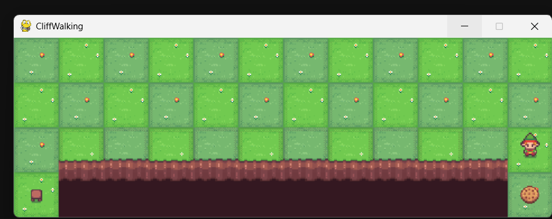

# CliffWalking 🤖

A reinforcement learning project implementing and comparing **SARSA** and **Q-Learning** algorithms on the classic CliffWalking gridworld environment.



## Introduction

This project trains agents using two model-free RL algorithms on a 4×12 gridworld where an agent must navigate from start to goal while avoiding a cliff.

- **SARSA** (On-policy) — learns a safe path, avoids the cliff
- **Q-Learning** (Off-policy) — finds the optimal but risky shortcut

**Reward structure:**
- Normal step: `-1`
- Cliff fall: `-100` (episode resets)
- Goal reached: `0`

## Installation

```bash
git clone https://github.com/sharathgowdaur-jpg/CliffWalking_-SARSA-Q_Learning-game
cd CliffWalking
pip install
!pip install gymnasium
!pip install "gymnasium[toy-text]"

```

**Requirements:** Python 3.7+, NumPy, Matplotlib

## Usage

```bash
python main.py --episodes 500 --alpha 0.1 --gamma 0.99 --epsilon 0.1
```

| Parameter | Default | Description |
|-----------|---------|-------------|
| `--episodes` | 500 | Training episodes |
| `--alpha` | 0.1 | Learning rate |
| `--gamma` | 0.99 | Discount factor |
| `--epsilon` | 0.1 | Exploration rate |

## How It Works

```
S . . . . . . . . . . .
. . . . . . . . . . . .
. . . . . . . . . . . .
. C C C C C C C C C . G   ← S=Start  G=Goal  C=Cliff
```

| Algorithm | Policy | Avg Reward | Path |
|-----------|--------|-----------|------|
| SARSA | On-policy | ~-17 | Safe (top route) |
| Q-Learning | Off-policy | ~-13 | Risky (cliff edge) |

